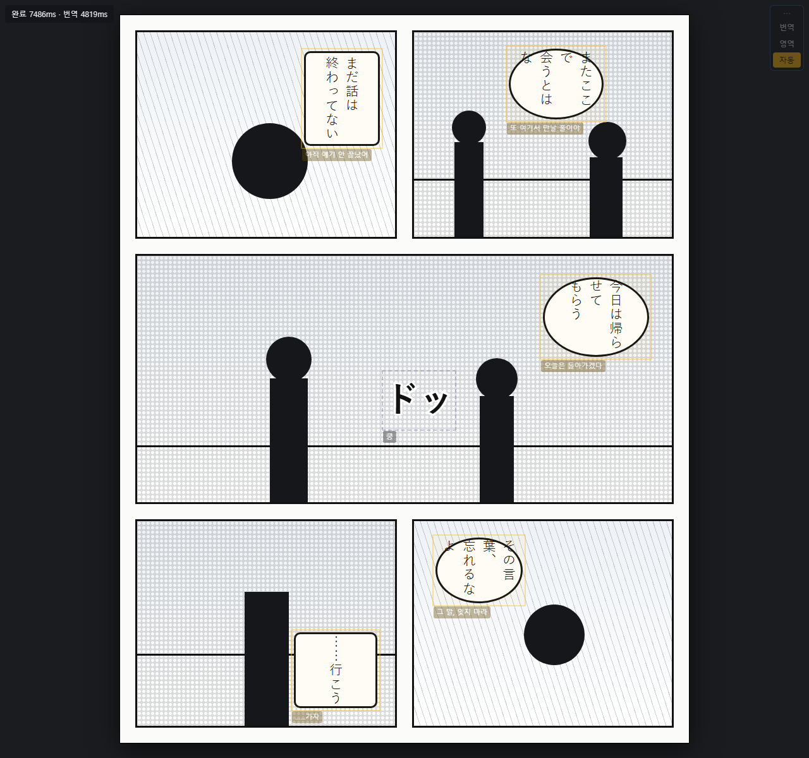
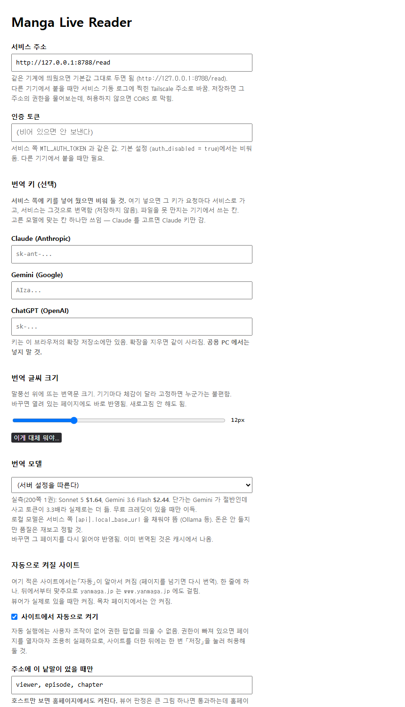

# Manga Live Reader

일본 만화 뷰어 화면을 캡처해 OCR + 번역을 원래 말풍선 위에 겹쳐 보여 준다.
번역본을 따로 만들지 않고 보고 있는 화면에 그대로 얹는다.

| 조각 | 하는 일 | 도는 곳 |
|---|---|---|
| mtl-service | 말풍선 검출, OCR, 번역 | GPU 있는 기계 (파이썬) |
| 확장 | 화면 캡처, 오버레이 표시 | 크롬 (압축해제 로드) |

서버는 아무도 호스팅하지 않음. 각자 자기 기계에 띄우고 자기 API 키를 씀.
키는 서비스 쪽 파일에만 있고 확장은 키를 모름.

처음이면 [QUICKSTART.md](QUICKSTART.md) 부터. 명령 복사해 붙이면 되는 설치 안내 (30분).

- [QUICKSTART.md](QUICKSTART.md) - 설치만
- `DESIGN.md` - 무엇을 왜 만드는가
- `PROGRESS.md` - 어디까지 왔고 무엇이 남았는가
- `extension/README.md` - 확장 내부

주석과 문서가 `DEVLOG.md`(개발일지)를 가리키는데 그 파일은 공개하지 않음. 설계에
필요한 결론은 `DESIGN.md` 와 모듈 주석에 옮겨 둠.

---

## 화면



그림(칸·말풍선·인물)은 직접 그린 것. 만화는 저작물이라 저장소에 넣지 않음.
그 위에 얹힌 것은 실제 파이프라인 결과:

| | |
|---|---|
| 노란 박스 위치 | comic-text-detector 가 낸 bbox |
| 일본어 원문 | manga-ocr 이 읽은 것 (6곳 전부 맞음) |
| 한국어 라벨 | gemini-3.6-flash 번역 |
| 「쿵」 점선 박스 | 모델이 효과음(sfx)으로 분류 |
| 왼쪽 위 숫자 | 실제 소요 시간 (검출 584ms, OCR 4519ms, 번역 8122ms) |

다시 만들려면 `docs/shoot.sh` + `docs/run_demo.py` (GPU·API 키 필요).
오버레이는 `extension/overlay.css` 를 그대로 쓰고 DOM 구조도 `content.js` 와 같음.

### 옵션 화면



실물 그대로. 같은 기계에 띄웠으면 손댈 것 없고, 다른 기기에서 붙을 때만 주소와
토큰을 넣음.

---

## 필요한 것

- 파이썬 3.11 (3.12 이상 불가, `requires-python = ">=3.11,<3.12"`)
- [uv](https://docs.astral.sh/uv/)
- NVIDIA GPU 권장. CPU 도 돌지만 OCR 10배 느려 실사용 어려움 (`[models].device = "cpu"`)
- 번역 API 키 하나. Anthropic 또는 Google(Gemini)
  - 200쪽 1권 기준 claude-sonnet-5 $1.64, gemini-3.6-flash $2.44

RTX 50 시리즈(sm_120)는 torch 가 cu128 빌드여야 함. `pyproject.toml` 에 인덱스를
박아 두었으니 `uv sync` 면 맞춰짐. 기본 PyPI 휠에는 sm_120 커널이 없어
`no kernel image is available` 로 죽음.

## 설치

```bash
uv sync                                     # 3.11 이 기본이 아니면 --python 3.11
uv run python scripts/fetch_models.py       # 검출기·OCR 가중치 (저장소에 없음)
```

키는 파일 하나에. `service.toml` 에 넣지 않음 (커밋되는 파일):

```bash
mkdir -p ~/.config/mangalivereader
printf 'ANTHROPIC_API_KEY=sk-ant-...\n' > ~/.config/mangalivereader/env
# 또는 GEMINI_API_KEY=...   확인: uv run python scripts/check_keys.py
```

```bash
uv run mtl-service
```

```
GPU: NVIDIA GeForce RTX 5080 · torch 2.11.0+cu128
mtl-service → http://127.0.0.1:8788
```

```bash
curl -s http://127.0.0.1:8788/health
# {"status":"ok","models_loaded":false,"gpu":"NVIDIA GeForce RTX 5080",...}
```

`models_loaded` 는 첫 요청 때 true. 미리 올리려면 `curl -X POST .../warmup`.

### 확장

`chrome://extensions` → 개발자 모드 켜기 → 압축해제된 확장 프로그램을 로드 →
이 저장소의 `extension/` 폴더.

기본 서비스 주소가 `http://127.0.0.1:8788/read` 라 같은 기계면 옵션 화면 손댈 것
없음. 만화 페이지에서 `Alt+Shift+M` (또는 툴바 아이콘).

## 쓰는 법

한 번 읽으면 오른쪽 위에 버튼 패널이 뜸. 단축키를 몰라도 마우스로 다 됨.

| 버튼 | 단축키 | |
|---|---|---|
| 번역 | `Alt+Shift+M` | 이 페이지를 캡처해 번역 (뷰어 자동 탐지) |
| 갱신 | `Alt+Shift+R` | 캐시 지우고 다시 번역 (`Shift`+「번역」 클릭도 같음) |
| 영역 | `Alt+Shift+D` | 읽을 영역을 드래그로 지정 (자동 탐지 실패용) |
| 자동 | | 페이지가 넘어가면 알아서 다시 읽음 |
| 라벨 | `Alt+Shift+L` | 라벨 전체 펼치기/접기 |
| 효과음 | `Alt+Shift+S` | 효과음·잡문도 표시 |
| 음성 | `Alt+Shift+P` | 원문 소리내어 읽기 |
| 숨김 | `` ` `` (누르는 동안) | 오버레이를 감춰 원문 그림 보기. 버튼은 고정 숨김 |
| 상태 | | 왼쪽 위 상태줄 켜기/끄기 |

- 켜짐/꺼짐이 있는 버튼(자동·라벨·효과음)은 켜져 있으면 주황색
- 라벨은 기본이 마우스 올릴 때만 표시. 전부 펼치면 아래쪽 말풍선을 가림
- 자동은 기본 꺼짐. 켜면 클릭·키·휠·DOM 변화 후 0.7초 조용해지면 캡처하고,
  화면 해시가 달라졌을 때만 읽음 (같은 페이지 재번역 안 함)
- 음성은 기본이 브라우저 내장. 학습된 목소리는 음성 서버 별도 (아래)

만화가 아닌 페이지에서는 잘 안 됨. 청공문고 『羅生門』 페이지 실측:

```
검출 2개
제목  (108,98,122,96)   羅生門芥川龍之介  → 정확
본문  (99,281,900,719)  ．．．            ← 페이지 전체가 한 덩어리
```

manga-ocr 은 말풍선 한 조각을 읽는 모델이고 검출기도 만화 칸을 전제함.

자세한 것은 `extension/README.md`.

## 설정

`service.toml` 하나. 값마다 근거가 주석에 있음 (대부분 실측).

이 파일을 고치지 말고 `service.local.toml` 을 만들 것. 커밋되지 않고, 적은 절의
적은 키만 이김:

```toml
[models]
device = "cpu"

[api]
model_fast = "gemini-3.6-flash"
model_quality = "gemini-3.6-flash"
```

키와 시크릿은 이 파일에도 넣지 않음. 찾는 순서 (`src/mtl_service/env.py`):

1. `$MTL_ENV_FILE`
2. `~/.config/mangalivereader/env` (권장)
3. `<프로젝트 루트>/.env.local`

환경변수가 파일보다 우선. 형식은 `KEY=값` 한 줄씩. 들어가는 것:
`ANTHROPIC_API_KEY`, `GEMINI_API_KEY`, `OPENAI_API_KEY`, `MTL_AUTH_TOKEN`.

확장 옵션 화면에도 키 칸이 있음 (Claude / Gemini / ChatGPT 따로). 파일을 못 만지는
기기에서 쓰라고 둔 것. 넣으면 고른 모델에 맞는 것 하나만 `X-Api-Key` 로 서비스에
가고 서비스는 그 키로 번역함 (저장하지 않음). 서비스 쪽에 키가 있으면 비워 둘 것.

### 로컬 모델

`[api].local_model` 과 `local_base_url` 을 채우면 확장 옵션의 「로컬 모델」이 동작함.
OpenAI 호환이면 무엇이든 됨 (Ollama, LM Studio, vLLM):

```toml
[api]
local_model = "gemma-4-12b"
local_base_url = "http://100.x.y.z:11434/v1"
```

돈은 안 들지만 품질은 재봐야 함 (`scripts/ab_translate.py`). OCR 과 같은 카드에서
돌리면 SM 경합으로 OCR 지연이 흔들리므로 별 기계 권장.

### 인증

기본은 루프백 바인딩 + 인증 없음. 이 기계 안에서만 붙으므로 안전.
공유 시크릿은 `service.toml` 이 아니라 `MTL_AUTH_TOKEN` 으로 줌 (아래 ② 참고).

인증을 켜 놓고 토큰이 없으면 기동 거부. 요청마다 500 을 내는 것보다 나음.

## 서비스 여는 법

바인딩은 루프백 아니면 Tailscale 주소 둘뿐. `0.0.0.0` 폴백 없고, Tailscale 주소를
못 찾으면 기동 거부 (`__main__.py`). 만화 화면을 통째로 받는 엔드포인트를 설정
실수로 LAN 에 열지 않기 위함.

### 1. 같은 기계에서만 (기본)

설정 필요 없음. `uv run mtl-service` → 확장이 기본값 `http://127.0.0.1:8788/read`
로 붙음.

### 2. 다른 기기에서 (맥북, 아이패드, 다른 PC)

서비스는 GPU 있는 기계에서만 돌고, 다른 기기는 확장만 깔면 됨. 캡처와 오버레이는
브라우저가 하고 연산은 전부 원격.

[Tailscale](https://tailscale.com) 로 같은 tailnet 에 넣은 뒤:

① 서비스 쪽 `service.local.toml`

```toml
[server]
dev_bind_loopback = false     # Tailscale 주소에만 바인딩
auth_disabled = false         # 밖에서 붙으면 인증 켜기
```

토큰을 만들어 키 파일에 넣음:

```bash
printf 'MTL_AUTH_TOKEN=%s\n' "$(python3 -c 'import secrets;print(secrets.token_urlsafe(32))')" \
  >> ~/.config/mangalivereader/env
```

기동 로그가 바인딩한 주소를 그대로 찍음:

```
mtl-service → http://100.x.y.z:8788
```

② 방화벽 (서비스 기계가 윈도우일 때만). PowerShell 관리자 권한:

```powershell
New-NetFirewallRule -DisplayName 'mtl-service (Tailscale)' `
  -Direction Inbound -Protocol TCP -LocalPort 8788 `
  -InterfaceAlias 'Tailscale' -Profile Private -Action Allow
```

인터페이스 이름은 `Get-NetAdapter` 로 확인 (보통 `Tailscale`).

프로그램 경로로 좁히면 안 됨. venv 의 `python.exe` 는 기반 인터프리터로 넘겨
실행되므로 프로세스 이미지 경로가 시스템 python 으로 잡힘. 규칙을
`.venv\Scripts\python.exe` 로 걸었더니 서비스는 뜨는데 다른 기기만 조용히 막힘.

③ 확장 옵션 화면

| 칸 | 값 |
|---|---|
| 서비스 주소 | `http://100.x.y.z:8788/read` (기동 로그의 주소) |
| 인증 토큰 | 위에서 만든 값 |

저장할 때 확장이 그 주소의 권한을 요청함 (`optional_host_permissions`). 허용하지
않으면 CORS 로 막힘. 주소만 바꾸고 권한을 안 주는 것이 흔한 실패.

④ 확인 (클라이언트 기기에서)

```bash
curl -s http://100.x.y.z:8788/health
curl -s -X POST http://100.x.y.z:8788/warmup -H 'X-Auth-Token: <토큰>'
```

`/health` 는 토큰 없이 되고 `/warmup`·`/read`·`/cache/purge` 는 필요. 틀리면 401.

### 3. 재부팅해도 뜨게

리눅스 - `~/.config/systemd/user/mtl-service.service`:

```ini
[Unit]
Description=mtl-service
After=network-online.target

[Service]
WorkingDirectory=%h/MangaLiveReader
ExecStart=%h/MangaLiveReader/.venv/bin/python -m mtl_service
Restart=on-failure
RestartSec=5

[Install]
WantedBy=default.target
```

```bash
systemctl --user enable --now mtl-service
loginctl enable-linger $USER     # 빠뜨리면 로그인 전에는 안 뜸
journalctl --user -u mtl-service -f
```

윈도우 - 작업 스케줄러. 콘솔 창을 안 띄우려면 `pythonw.exe`:

```cmd
schtasks /Create /TN mtl-service /SC ONLOGON /RL LIMITED /F ^
  /TR "cmd /c cd /d C:\경로\MangaLiveReader && if not exist logs mkdir logs && .venv\Scripts\pythonw.exe -X utf8 -m mtl_service >> logs\service.log 2>&1"
```

`pythonw` 는 콘솔이 없어 출력이 사라지므로 로그를 파일로 남겨야 함. Tailscale
바인딩이면 `tailscaled` 가 먼저 올라와야 하니 작업 속성에서 실패 시 재시도 켜 둘 것.

### 4. 인터넷 공개는 권하지 않음

각자 자기 기계에 띄우는 것이 전제 (`DESIGN.md` §15). 그래도 열려면 앞단에
프록시(Tailscale Funnel, cloudflared)를 두게 되는데, 서비스는 프록시가 붙었는지
알 방법이 없음. 최소 조건:

- `auth_disabled = false`. 안 켜면 아무나 API 크레딧을 태울 수 있음
- 동시 요청 상한. GPU 워커가 하나라 큐가 무한히 쌓임 (아직 없음)
- 지출 상한. 비용은 로그로만 남고 막는 것이 없음 (아직 없음)
- `/read` 는 SSE. 프록시가 버퍼링하면 점진 표시가 죽음

### 안 될 때

| 증상 | 원인 |
|---|---|
| `Tailscale 인터페이스를 찾지 못해 기동을 거부한다` | `tailscale status` 확인. WSL 안에서는 윈도우의 Tailscale 이 안 보임 |
| `인증이 켜져 있는데 토큰이 없다` | `MTL_AUTH_TOKEN` 이 서비스 프로세스에 안 보임. `scripts/check_keys.py` |
| 401 | 확장 옵션의 토큰이 서버 값과 다름 |
| 다른 기기에서 응답 없음 | ② 방화벽. 서비스는 멀쩡히 떠 있고 클라이언트만 막힘 |
| CORS 오류 | 주소를 바꾼 뒤 「저장」을 안 눌러 권한 미허용 |
| 번역 없이 원문만 나옴 | API 키 없음. 기동 로그에 경고 |
| OCR 이 10배 느림 | CUDA 를 못 잡아 CPU 로 떨어짐. 기동 로그의 `GPU:` 줄 확인 |

Retina(dpr=2)는 미검증. 좌표 계산은 `devicePixelRatio` 를 타고 들어가 있지만
(`background.js` 의 `cropAndNormalize`, `content.js` 의 `toCss`) 2배 화면에서 돌려
본 적 없음. 라벨이 말풍선에서 절반만큼 밀리면 dpr 을 두 번 곱했거나 빠뜨린 것.

## 음성 서버 (선택)

원문을 학습된 목소리로 읽는 기능. 안 띄우면 브라우저 내장 음성으로 돌아감.

서버는 별도 저장소:
[gpt-sovits-server](https://github.com/vanillapapaya/gpt-sovits-server).
음색 가중치는 어느 쪽에도 없음 (각자 학습하거나 구해서 넣음).

다른 엔진을 쓰려면 엔드포인트 두 개만 맞추면 됨:

```
GET  /voices
  → {"voices": ["anon-jp", "soyo-jp"],
     "default": "anon-jp",                                          # 없어도 됨
     "info": {"anon-jp": {"description": "옵션 화면에 보일 설명"}}}   # 없어도 됨

POST /tts
  ← {"text": "…", "language": "Japanese" | "Korean", "voice": "anon-jp"}
  → 오디오 바이트 (Web Audio 로 디코드되면 됨. wav 로 실측)
```

- `text` 만 필수. `voice` 는 「(서버 기본값)」을 고르면 빠짐
- stock GPT-SoVITS `api_v2.py` 로는 안 됨. `/voices` 가 없고 `/tts` 바디가 다름
- CORS 헤더 불필요. 합성 요청은 background 워커가 하므로 확장 출처로 나감
- 서버가 실패하면 조용히 내장 음성으로 떨어짐
- 모델은 미리 로드해 둘 것. 요청마다 올리면 첫 말풍선이 수십 초
- 바인딩을 좁힐 것. `0.0.0.0` 은 tailnet 뿐 아니라 집 LAN 에도 열림
- 별 기계 권장. GPU 경합은 실측에서 OCR 지연을 13배 흔들었음. 합성은 RTF 0.25 라
  한 칸만 미리 합성해 두면 말풍선 사이가 안 끊김

옵션 화면 「음성」 칸에 주소를 넣고 「목록 불러오기」. `Alt+Shift+P` 로 읽음.

## 개발

```bash
uv run pytest -q
```

GPU·네트워크 없이 도는 것만 있음. 파이프라인 전체 검증은 `scripts/debug_page.py`.

`scripts/` 의 도구: `ab_translate.py`(모델 A/B), `check_merge.py`·`check_order.py`
(픽스처 회귀), `send_page.py`, `crop_viewer.py`.

만화 캡처는 저작물이라 저장소에 넣지 않음. 정답 표는 좌표만 담은
`test/fixtures/*.json`.

키가 커밋에 섞이는 것을 막는 훅이 있음. 클론 후 한 번 켜 둘 것:

```bash
git config core.hooksPath .githooks
```

## 이 저장소를 만든 환경 (윈도우 + WSL)

여기부터는 저자 환경 메모. 다른 환경이면 필요 없음.

### venv 가 둘

`uv sync` 는 플랫폼별 휠을 받으므로 윈도우와 WSL 이 공유 불가.

| | 경로 | |
|---|---|---|
| 윈도우 | `.venv/Scripts/python.exe` | `run-service.cmd` |
| WSL | `~/.venvs/mlr/bin/python` | `run-service.sh` 가 씀 |

리눅스 venv 를 `/mnt/c` 에 두지 말 것. drvfs 라 `import torch` 가 35.9초
(ext4 는 2.0초, 차이가 전부 I/O 대기). 소스는 `/mnt/c` 에 둬도 됨.

```bash
UV_PROJECT_ENVIRONMENT=~/.venvs/mlr uv sync --python 3.11
```

`--python 3.11` 필수. WSL 기본이 3.14 인데 프로젝트는 `<3.12`.

WSL 셸에서 맨 `uv sync`/`uv run` 금지. 기본 대상이 `.venv` 인데 그것은 윈도우용이라
리눅스 휠로 덮어써서 윈도우 쪽이 깨짐.

`py -X utf8 -m mtl_service` 금지. `py` 는 시스템 파이썬이라 의존성이 없음.
윈도우에서는 `-X utf8` 필수 (없으면 로그 한글이 cp949 로 깨짐).

테스트는 경로를 박아 부름:

```bash
~/.venvs/mlr/bin/python -m pytest -q            # WSL
.venv\Scripts\python.exe -X utf8 -m pytest -q   # 윈도우 cmd
```

### run-service.sh 가 파이썬을 고름

| `dev_bind_loopback` | 바인딩 | 실행되는 것 | 맥북에서 |
|---|---|---|---|
| `true` | `127.0.0.1` | 리눅스 venv (WSL 안) | ✗ |
| `false` | Tailscale 주소 | 윈도우 venv (WSL 셸에서 대신 띄움) | ✓ |

WSL 은 Tailscale 주소에 바인딩 불가. NAT 뒤(172.30.x)라 윈도우의 Tailscale
인터페이스가 안 보이고 `bind_tailscale_only` 가 주소를 못 찾아 기동 거부.
그 경우 스크립트가 윈도우 파이썬을 대신 띄움 (WSL 셸에서 그대로 돌고 로그도 여기로
나오며 Ctrl+C 도 먹음).

WSL 의 `~` 는 윈도우 프로필이 아님. 키가 윈도우 쪽에 있으면 `run-service.sh` 가
`/mnt/c/Users/<사용자>/.config/mangalivereader/env` 를 찾아 `MTL_ENV_FILE` 로
잡아 줌. 복사하지 말 것 (두 군데가 되면 나중에 하나만 갈게 됨).

### 윈도우 인바운드

`mtl-service (Tailscale)` 규칙이 이미 걸려 있음 (Tailscale 인터페이스, Private
프로필, TCP 8788). 새로 만드는 법은 위 ②.

지우려면 `Remove-NetFirewallRule -DisplayName 'mtl-service (Tailscale)'`

---

## 라이선스

GPL-3.0-or-later (`LICENSE`).

고른 것이 아니라 정해진 것. `src/mtl_service/ctd/` 가
[comic-text-detector](https://github.com/dmMaze/comic-text-detector)(GPL-3.0)와
그 안의 [YOLOv5](https://github.com/ultralytics/yolov5) v6.x(GPL-3.0) 추론 코드를
발췌한 것이고 서비스가 그것을 직접 import 함. 무엇을 어떻게 옮겼는지는
`src/mtl_service/ctd/NOTICE.md`.

모델 가중치는 저장소에 없음. `scripts/fetch_models.py` 가 원 배포처에서 받고 각자의
라이선스를 따름 (comic-text-detector, `kha-white/manga-ocr-base`).

## 이용 범위

- 정식 구독 또는 사이트가 무료로 공개한 회차를 열람하는 중에만 사용
- 번역 결과와 캡처 이미지를 외부에 배포하지 않음
- 언어 장벽 때문에 읽지 못하는 것을 읽기 위한 보조 수단. 정식 번역판이 있으면
  그쪽이 나음
- 각 사이트 약관 확인은 쓰는 사람 책임. 라이선스가 그것까지 보장하지 않음
